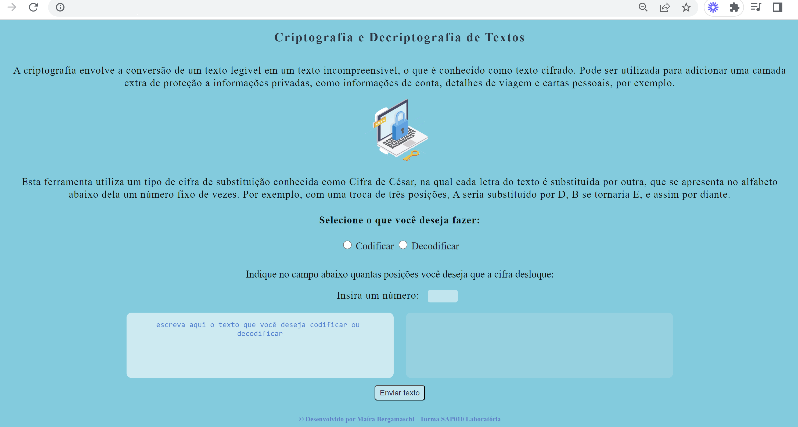
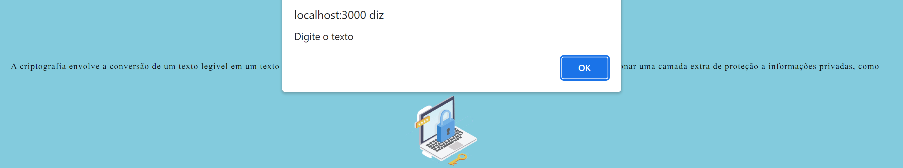

# Ferramenta de codificação e decodificação de textos

Primeiro projeto desenvolvido para o Bootcamp da Laboratória - Turma SAP010 (10ª turma). Essa aplicação permite que o usuário codifique ou descodifique textos utilizando um tipo de cifra de substituição conhecida como Cifra de César.

## Índice

- [1. Prefácio](#1-prefácio)
- [2. Resumo do projeto](#2-resumo-do-projeto)
- [3. Interface do projeto](#3-interface-do-projeto)
- [4. Objetivos alcançados](#5-objetivos-alcançados)
- [5. Link da aplicação](#5-link-da-aplicação)

---

## 1. Prefácio 

A [cifra de César](https://pt.wikipedia.org/wiki/Cifra_de_C%C3%A9sar)
é um dos primeiros tipos de criptografias conhecidas na história. É um
tipo de cifra por substituição, em que cada letra do texto original é
substituida por outra que se encontra há um número fixo de posições
(deslocamento) mais a frente do mesmo alfabeto.

Por exemplo se usarmos o deslocamento (_offset_) de 3 posições:

- Alfabeto sem cifrar: A B C D E F G H I J K L M N O P Q R S T U V W X Y Z
- Alfabeto com cifra: D E F G H I J K L M N O P Q R S T U V W X Y Z A B C
- A letra A será D
- A palavra CASA será FDVD

## 2. Resumo do projeto

Foi desenvolvida uma aplicação que permite ao usuário cifrar e decifrar um texto no navegador indicando um deslocamento
específico de caracteres (offset). 
É de suma importância ressaltar que essa aplicação funcina apenas para letras (sejam elas maiúsculas ou minúsculas). Caso o usuário entre com caracteres especiais ou números, esses permanecem os mesmos e não são codificados/decodificados.

## 3. Interface do projeto

 A aplicação apresenta uma breve introdução sobre a cifra de César e instruções diretas de como utilizá-la, proporcionando maior autonomia para o usuário. A interface permite ao usuário:
  - Eleger um número (offset) indicando quantas posições de deslocamento de caracteres quer que a cifra utilize.
  - Inserir uma mensagem e escolher se deseja codificar ou decodificar.
  - Visualizar e copiar o resultado da mensagem.

  

  É necessário que o usuário preencha todos os campos para prosseguir com a funcionalidade. Caso isso não seja realizado, o sistema emite um alerta que especifica qual/quais campos necessitam ser preenchidos.
  

## 4. Objetivos alcançados

- [🌟]Interface que permite ao usuário codificar e decodificar um texto.
- [🌟] Possibilidade de escolha do Offset (deslocamento) pelo usuário.
- [🌟] Interface onde o usuário digite a mensagem desejada.
- [🌟] Interface para visualização do resultado da cifra.
- [🌟] Alerta caso algum campo não seja preenchido.
- [🌟] Cifrar/Decifrar letras maiúculas/minúsculas.
- [🌟] Interface para visualização do resultado da cifra.

## 5. Link de acesso da aplicação:

